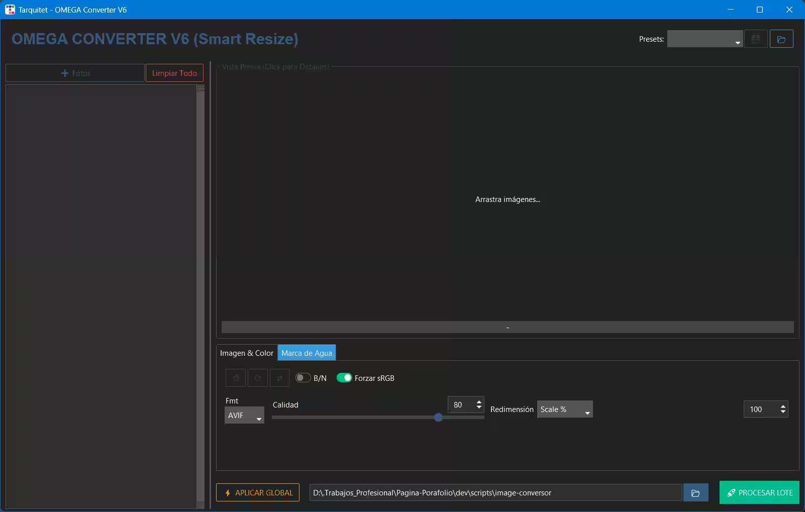

# 🚀 OMEGA Image Converter (v0.17)

> **A professional desktop suite for inspection, multithreaded optimization, non-destructive edits and bulk image conversion.**

The **OMEGA Image Converter** is an advanced GUI tool written in Python. It is designed for content creators, web developers and designers who need granular control over image compression, supporting everything from standard formats to modern formats such as AVIF and HEIC.




## ✨ Main Features (Updated v17)

- **📏 Exact Pixel Resizing:** Full control over the final size. Change dimensions by specifying the exact Width and Height in pixels, replacing the old percentage-based method.
- **🚀 Multithreaded (Multi-core) Processing:** Use all CPU cores to convert very large batches of images at optimized speed.
- **🔍 Advanced Visual Inspector (Curtain Mode):** Compare the original and the result pixel-by-pixel with a curtain effect, dynamic zoom and full analytics on click.
- **🧹 Advanced Queue Management:** Remove specific images from the work queue individually with a single click.
- **💾 Presets System:** Save your favorite configurations in a `presets.json` file for instant reuse.
- **©️ Logo and Watermark Insertion:** Add PNG logos or text with customizable opacity to your exports.
- **📦 Extreme Optimization:** Support for chroma subsampling (Chroma 4:2:0) to drastically reduce image weight and visual reports showing the exact percentage of savings.

## 🗂️ Supported Formats

| Modern Web Formats           | Classic Formats        | Design Formats       |
| :--------------------------- | :--------------------- | :------------------- |
| **AVIF** (Ultra compression) | **JPEG / JPG**         | **PSD** (Photoshop)  |
| **HEIC** (Apple/iOS)         | **PNG** (Transparency) | **PDF** (Document)   |
| **WEBP** (Google)            | **GIF** (Animated)     | **EPS** (PostScript) |
| **JPEG 2000**                | **BMP / ICO**          | **TIFF / TGA**       |

## ⚙️ Requirements & Installation

The script includes an **Auto-Installer**. On first run it will attempt to automatically download required dependencies.

**System requirements:**

- Python 3.8 or newer.

**Dependencies (installed automatically):**

- `ttkbootstrap` (modern GUI)
- `Pillow` (core image processing)
- `pillow-avif-plugin` (AVIF support)
- `pillow-heif` (HEIC support)

### Run

```bash
python Latest_<NAME>_<VERSION>.py
```

## 📖 Quick Usage Guide

1. **Add & Clean:** Click `➕ Add` to select images. If you pick the wrong file, use the individual `❌` to remove it from the list.
2. **Set Dimensions & Quality:** Select an image and set its new width/height in pixels. To apply this to the whole batch, use `⚡ APPLY GLOBAL`.
3. **Inspect Savings:** Check the info bar to see the exact percentage of weight saved. Click `Preview` to open the **Omega Inspector** fullscreen.
4. **Multithreaded Export:** Choose your output folder and press `🚀 PROCESS BATCH`. The multithreaded engine will process images in parallel.

## 📈 Project Evolution (Changelog)

- **v1–v5:** Initial format support, basic GUI and conversion capabilities.
- **v6–v9:** Implemented the Inspector with zoom and curtain effect, presets in `presets.json` and non-destructive edits.
- **v10:** Improved web color support and ability to overlay PNG logos.
- **v11:** Advanced display of compression metrics (savings percentage) in the UI.
- **v12:** Integrated the Multicore engine for parallel processing and faster batch speeds.
- **v13–v14:** UX improvements to allow closing and removing individual images from the work queue.
- **v15:** Scaling system change: moved from percentage-based resizing to exact pixel control (Width × Height).
- **v16:** Fixes and improvements for PNG and SVG support; better transparency handling and reduction of export artifacts.
- **v17 (Current):** Fixed transparency issues in WebP/AVIF, hardened the export pipeline and minor stability improvements.

### 💡 Tips

- **Use Multithreading:** For folders with hundreds of photos, version 15 will drastically reduce your waiting time.
- **Web Core Vitals:** For the web, export in **AVIF** with **Save Mode (4:2:0)** for better PageSpeed scores.

## ⚖️ Credits & Licenses

This project uses open-source libraries such as `Pillow`, `ttkbootstrap`, `pillow-heif` and `pillow-avif-plugin`.

[](README_es.md)
